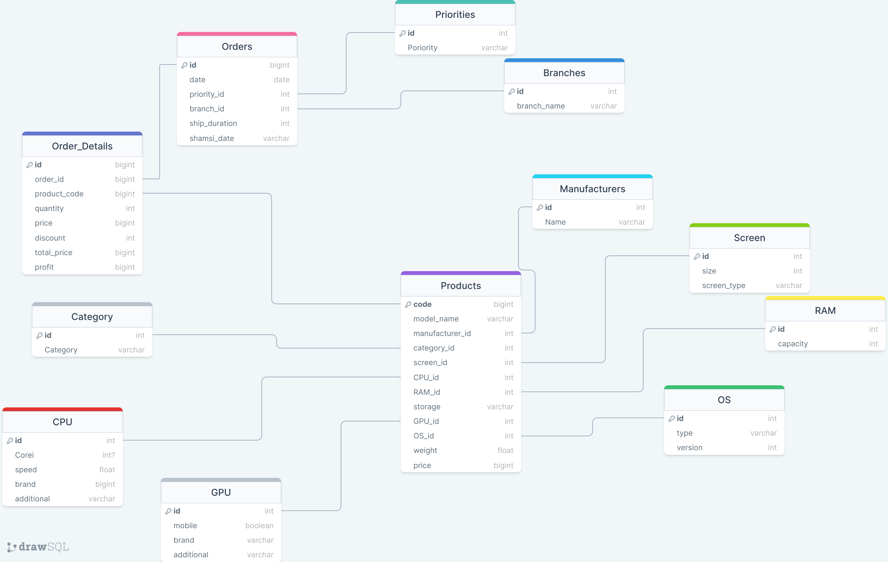
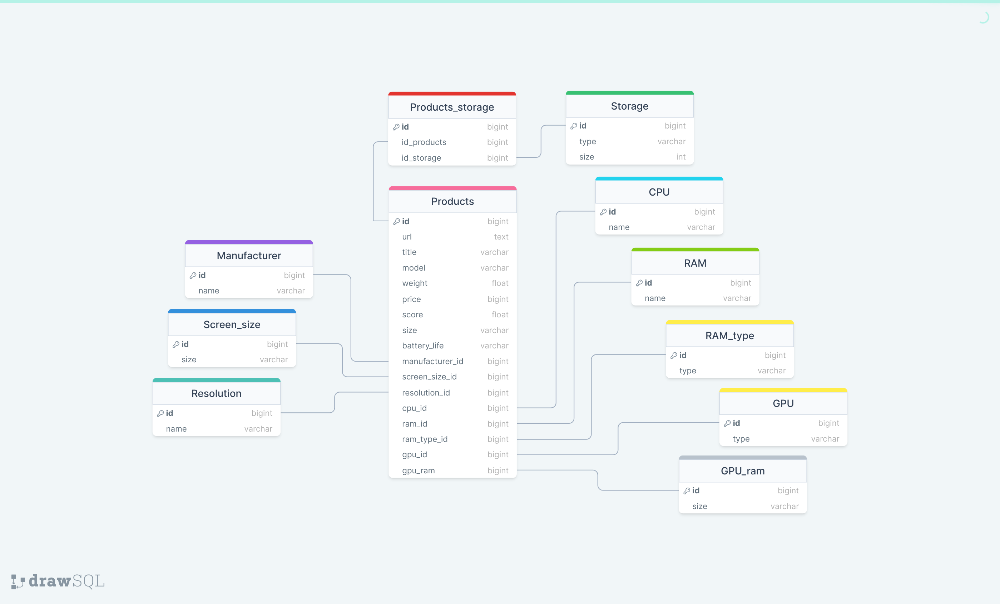
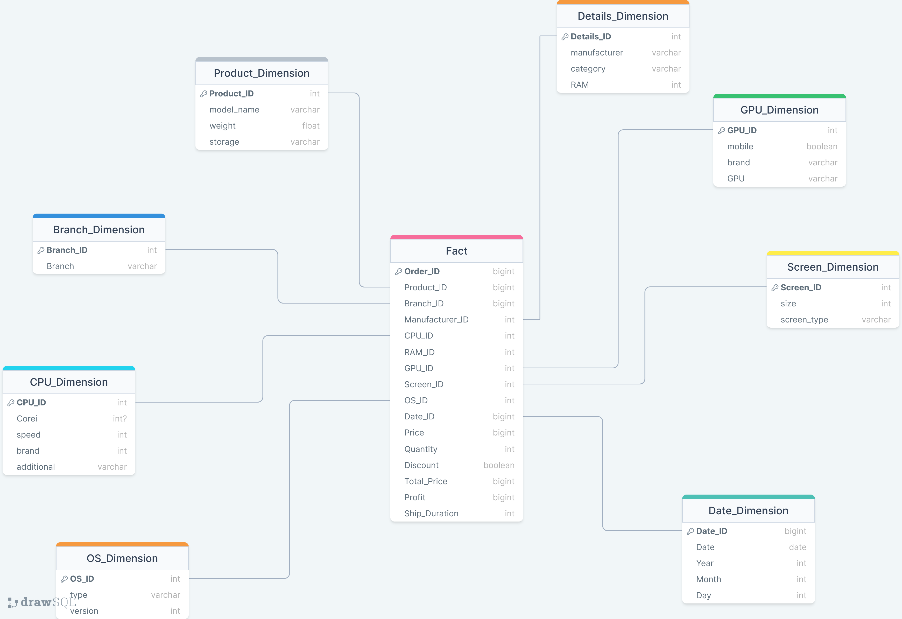

# lotech_data_analysis

  

  <h3 align="center">Iranketab_Quera_G7</h3>
  <h4 align="center">Iranbook website data analysis</h4>

## About The Project

The main goal of the project was to analyze information about lotech's sales data from the its database.
To achieve this goal, the following steps must be performed in order

- cleaning information from the .csv file, and made into a database

- Scraping data from rivals and creating a database for that also

- Datawarehousing in PowerBI using Power Query

- Creating an analysis dashboard for the employer's requests alongside with other analysis done by out team using Statistical analysis, Machine Learning techniques, ...
